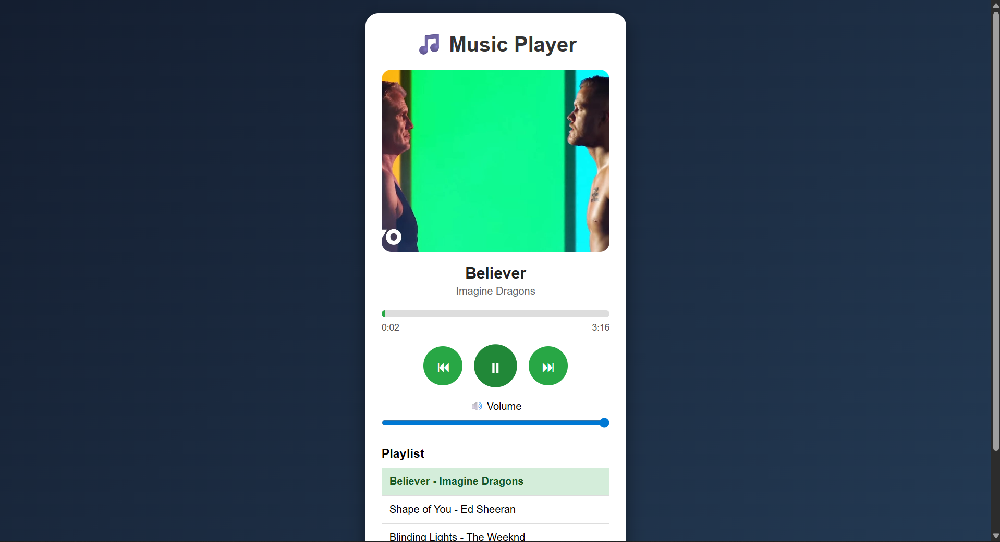

# CODEALPHA_TASK3
CODEALPHA INTERNSHIP TASK FOR FRONTEND DEVELOPMENT
You can use the following README format for your **Music Player using JavaScript** project:

# 🎵 Music Player using JavaScript

(screenshot of output of code alpha-12 for frontend development.png)(screenshot of output of code alpha-13 for frontend development.png)(screenshot of output of code alpha-14 for frontend development.png)(screenshot of output of code alpha-15 for frontend development.png)

## 📌 Project Overview

This project is a responsive and interactive **Music Player Web Application** built using **HTML, CSS, and JavaScript**. It allows users to play audio tracks, pause music, navigate between songs, adjust volume levels, monitor playback progress, and view song details such as title, artist, and duration. The application also includes playlist management and autoplay functionality for a seamless listening experience.

## 🚀 Features

* ▶️ Play Music
* ⏸️ Pause Music
* ⏭️ Next Song
* ⏮️ Previous Song
* 🎵 Display Song Title
* 🎤 Display Artist Name
* ⏱️ Show Song Duration
* 📊 Interactive Progress Bar
* 🔊 Volume Control
* 📂 Playlist Support
* 🔄 Auto Play Next Track
* 📱 Responsive User Interface
* ✨ Smooth Hover Effects and Animations
  
## 🛠️ Technologies Used

* HTML5
* CSS3
* JavaScript (ES6)
* HTML Audio API

## 📂 Folder Structure

*text
MUSIC_PLAYER/
│
├── index.html
├── style.css
├── script.js
├── README.md
├── screenshot.png
│
├── songs/
│   ├── believer.mp3
│   ├── shape_of_you.mp3
│   └── perfect.mp3
│
├── images/
│   ├── believer.jpg
│   ├── shape_of_you.jpg
│   └── perfect.jpg

## ▶️ How to Run

1. Download or clone the repository.
2. Open the project folder in Visual Studio Code.
3. Add your audio files to the **songs** folder.
4. Add corresponding cover images to the **images** folder.
5. Open **index.html** in a web browser.

### Alternative Method

1. Install the **Live Server** extension in VS Code.
2. Right-click on **index.html**.
3. Select **Open with Live Server**.

## 🎮 Controls

| Control       | Function              |
| ------------- | --------------------- |
| Play          | Starts music playback |
| Pause         | Pauses current song   |
| Next          | Plays next song       |
| Previous      | Plays previous song   |
| Progress Bar  | Seek within the song  |
| Volume Slider | Adjust audio volume   |

## 📱 Responsive Design

The music player is optimized for:

* Desktop Computers
* Laptops
* Tablets
* Mobile Devices

## 🎯 Learning Outcomes

Through this project, the following concepts were implemented:

* DOM Manipulation
* Event Handling
* Audio API Integration
* JavaScript Arrays and Objects
* Dynamic Content Updates
* Responsive Web Design
* User In
  
## 🔮 Future Enhancements

* Shuffle Songs
* Repeat Mode
* Dark/Light Theme Toggle
* Favorite Songs List
* Search Functionality
* Online Music Streaming Support

## 👨‍💻 Author

**GOURU SAI KOWSHIK REDDY**

⭐ If you found this project useful, consider giving it a star on GitHub!
